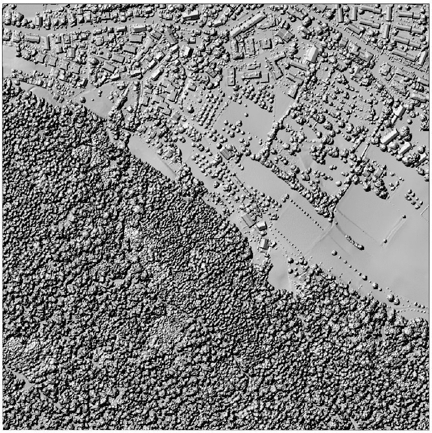

# LiDAR-Processing
This notebook was part of my master's thesis, where I have to process 40, 50 gigabytes of LiDAR data and use the end products (DEM's) as an input for a slope stability model which I was developing. 

This notebook effectively automates the LiDAR points clouds processing. It reads and analyzes all .las files in a specified folder, removing outliers and duplicates. Afterwards, interpolates point clouds files into a raster image (DEM) and mosaic all of the files together as a single raster (DEM).

The code's final portion executes post-processes for the generated DEM, fills no data values and depressions and generates geomorphometric rasters such as slope, curvature and hillshade.

